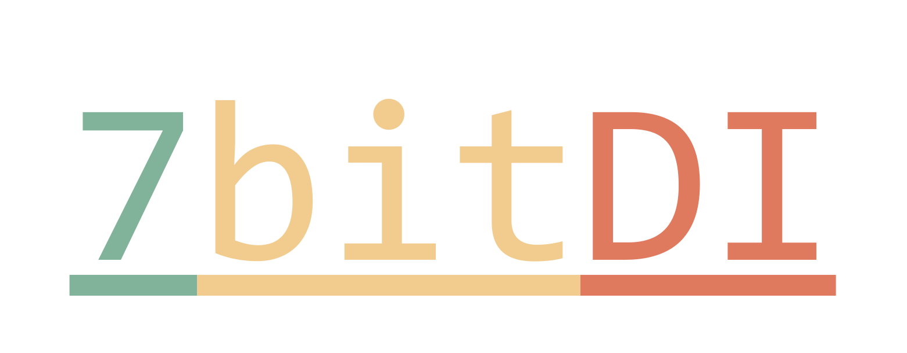

[](https://github.com/7bitcoder/7bitDI/actions/workflows/DevCI.yml)
[](https://github.com/7bitcoder/7bitDI/actions/workflows/MainCI.yml)

<div align="center">

  

  <h4>
    C++17 simple dependency injection library!
  </h4>

  <p>
    7bitDI is a simple C++ dependency injection library, designed to be as easy to use as possible, the main inspiration was the asp net core dependency injection system. 
  </p>

  <h4>
    <a href="https://7bitDI.readthedocs.io/en/latest/index.html">Documentation & Examples</a>
  </h4>
</div>

<br />

### Built With

- [Google Test](https://github.com/google/googletest)

### Sample Usage

```cpp
#include <SevenBit/DI.hpp>
#include <iostream>

using namespace sb::di;

struct IServiceA
{
    virtual std::string actionA() = 0;

    virtual ~IServiceA() = default;
};

struct IServiceB
{
    virtual std::string actionB() = 0;

    virtual ~IServiceB() = default;
};

struct ServiceA final : public IServiceA
{
    std::string actionA() { return "actionA"; }
};

struct ServiceB final : public IServiceB
{
    std::string actionB() { return "actionB"; }
};

class ServiceExecutor
{
    IServiceA *_serviceA;
    std::unique_ptr<IServiceB> _serviceB;

  public:
    ServiceExecutor(IServiceA *serviceA, std::unique_ptr<IServiceB> serviceB)
    {
        _serviceA = serviceA;
        _serviceB = std::move(serviceB);
    }

    std::string execute() { return _serviceA->actionA() + ", " + _serviceB->actionB() + " executed."; }
};
int main()
{
    ServiceProvider::Ptr provider = ServiceCollection{}
                                         .addSingleton<IServiceA, ServiceA>()
                                         .addTransient<IServiceB, ServiceB>()
                                         .addScoped<ServiceExecutor>()
                                         .buildServiceProvider();

    ServiceExecutor &executor = provider->getService<ServiceExecutor>();

    std::cout << executor.execute();
    return 0;
}
```

Output

```console
actionA, actionB executed.
```

More examples and tutorials are available on the
[Documentation & Examples](https://7bitDI.readthedocs.io/en/latest/index.html) page

@7bitcoder Sylwester Dawida 2023
